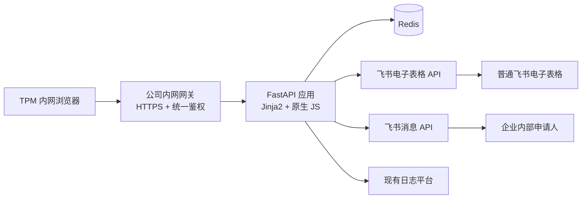
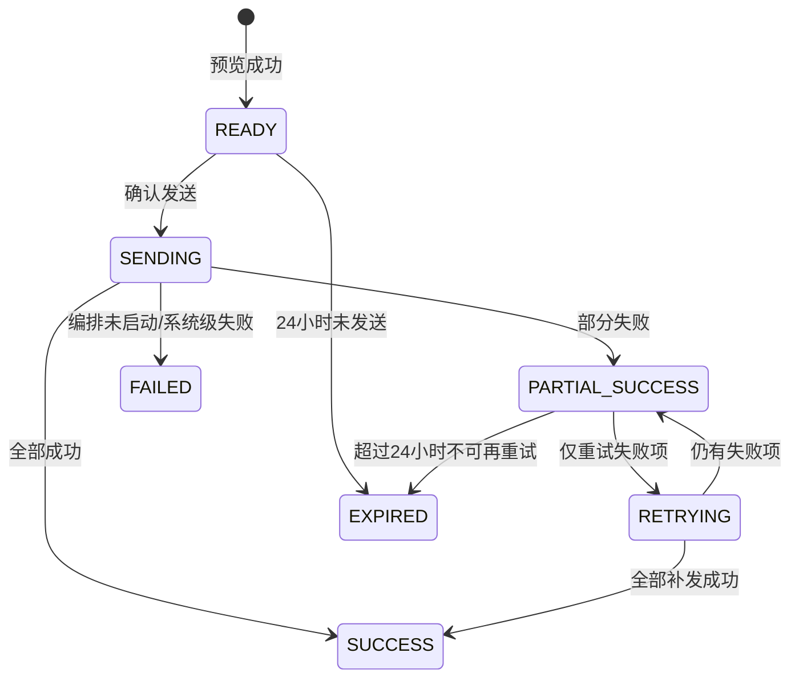

# 资源权限_样机需求_飞书机器人跟催——冻结实施方案

> 文档状态：**已冻结**  
> 版本：V1.2  
> 冻结日期：2026-09-16  
> 适用范围：一期 MVP  
> 可行性状态：**读表、身份映射和机器人单聊发送链路已完成真实 OpenAPI 验证**  
> 说明：本文是实施基线。后续如需改变输入参数、表格模板、空值规则、发送范围、权限模型或自动触发方式，必须走变更评审，不得在开发过程中口头扩展。

## 1. 方案结论

一期建设一个部署在公司内网的轻量 Web 应用。TPM 输入飞书电子表格链接和硬件阶段名称，系统使用飞书自建应用读取指定工作表，识别该阶段下仍为空的业务领域，通过“申请人邮箱”换取 `open_id`，按申请人合并生成只读预览；TPM确认后，系统按照预览快照使用同一自建应用的机器人能力发送飞书消息卡片。

本系统不替代飞书已有的日期提醒。自研的必要性仅来自以下差异化能力：

1. 根据当前单元格是否为空，只催尚未完成者；
2. 同一申请人的多个未完成业务领域合并为一条消息；
3. TPM发送前可以统一预览和确认；
4. 集中记录发送结果、失败原因和重试状态。

若未来业务取消“仅催未完成者”的要求，应优先停用本系统并回归飞书原生日期提醒。

## 2. 冻结范围

### 2.1 一期包含

- 支持公司内部普通飞书电子表格 `/sheets/` 直链和指向普通电子表格的 `/wiki/` 链接；
- 支持从 `/sheets/` URL 解析 `spreadsheet_token` 和 `sheet_id`，或将 `/wiki/` 节点解析为底层 `sheet` 对象；
- 支持输入一个目标硬件阶段；
- 使用飞书自建应用身份读取目标工作表；
- 根据冻结模板定位业务领域、目标阶段、截止时间、申请人和申请人邮箱；
- 以目标阶段单元格是否为空判断未完成；
- 按申请人合并未完成业务领域；
- 提供预览、二次确认、发送结果和失败项重试页面；
- 使用机器人向企业内部成员发送消息卡片；
- 使用 Redis 保存预览快照、幂等状态和发送结果；
- 接入现有日志平台，输出脱敏结构化日志；
- 提供 Docker 镜像并支持多实例部署。

### 2.2 一期不包含

- 非普通电子表格类型的 `/wiki/` 节点、多维表格、飞书问卷及 Excel 文件；
- 定时扫描、自动发送、周期性跟催或复杂工作流；
- AI识别、语义判断或消息内容自动生成；
- 读取或理解已填写的业务内容；
- 修改电子表格；
- 多阶段同时扫描；
- 部门解析、部门汇总或向群组发送；
- 外部联系人、跨租户用户或非人员接收对象；
- TPM个人身份存储、操作人审计和应用内用户管理；
- 可编辑预览、选择性发送或临时增删接收人；
- 独立业务数据库；
- 真实开发、联调和上线工作（本文只定义未来实施方案）。

## 3. 核心业务规则

### 3.1 输入规则

预览只有两个业务输入：

```json
{
  "spreadsheetUrl": "https://transsioner.feishu.cn/wiki/{wiki_token}",
  "stageName": "PR1"
}
```

- `spreadsheetUrl` 必须是公司域名下的 `/sheets/` 或 `/wiki/` 链接；
- `/sheets/` 链接必须包含唯一工作表 `sheet_id`；
- `/wiki/` 节点必须解析为普通电子表格 `sheet`；若底层电子表格只有一个页签则自动选用，存在多个页签时提示用户改用包含 `sheet_id` 的 `/sheets/` 直链；
- `stageName` 去除首尾空格后不能为空；
- 阶段采用不区分大小写的完整匹配；例如 `pr1` 可以匹配 `PR1`，但不能匹配 `PR1-A`；
- 阶段零匹配或多匹配均视为结构性错误，禁止预览；
- `previewId` 由服务端生成，调用方不得传入。

### 3.2 未完成判断

每个数据行代表一个业务领域，例如摄像头、信号或传感器。每个“业务领域 × 硬件阶段”组合都必须显式填写。

目标阶段单元格满足以下任一条件时视为未填写：

- API返回 `null`；
- 空字符串；
- 去除首尾空白字符后为空；
- 公式计算结果为空字符串。

以下内容均视为已填写，系统不解释其业务含义：

- 任意非空文本；
- 数字，包括 `0`；
- `无需求`、`不适用`等明确文本；
- 公式计算出的非空结果。

系统每次主动预览都扫描当前空值，不因截止时间未到或已经逾期而跳过。截止时间只用于消息展示。

### 3.3 责任人规则

- 每个业务领域必须且只能对应一个申请人和一个申请人邮箱；
- `申请人`单元格必须使用飞书 `@成员`，仅用于人工展示；普通电子表格 API 返回的 mention `token` 已实测不能作为通讯录 `user_id`；
- `申请人邮箱`为机器匹配的唯一数据源，系统去除首尾空格并按不区分大小写处理；
- 系统通过通讯录 `batch_get_id` 接口把邮箱换取为 `open_id`，再以 `open_id`作为聚合键和消息接收标识；
- 一期只接受本企业租户内成员；
- 不做姓名、工号或 mention `token` 的模糊/猜测匹配；
- 邮箱缺失、格式非法、重复映射或无法换取唯一 `open_id` 时，该行作为行级异常隔离；
- 相同成员负责多个未完成业务领域时，按表格原顺序去重并合并为一个接收对象。

### 3.4 截止时间规则

- 每个阶段必须有独立截止时间；
- 截止时间必须位于该阶段列对应的“截至时间”位置；
- 仅有日期时，以 `Asia/Shanghai` 当日 `23:59:59` 为截止边界；
- 含具体时间时，按表内时间并统一转换为 `Asia/Shanghai` 判断；
- 截止当日展示“今日截止”；次日零点起展示“已逾期 N 天”；截止日前展示“剩余 N 天”；
- 日期缺失、无法解析或一个阶段对应多个日期时，视为结构性错误。

### 3.5 项目名称和部门

- 项目名称取电子表格文件名，不解析表内合并标题；
- 一期不读取、不展示、不存储部门信息；
- 消息中的跳转链接使用用户输入并经校验后的原始工作表链接。

### 3.6 发送规则

- 预览为只读，不能勾选、取消或编辑任何接收人和业务领域；
- 清单有误时，TPM必须修改原表并重新预览；
- 确认发送时直接使用 Redis 中的预览快照，不重新读取或比对表格；
- 预览后原表发生变化的风险由确认人承担；
- 同一申请人在同一预览中只发送一张卡片；
- 单次最多处理 300 个业务数据行和 300 名不同申请人；超过任一上限时整体失败，禁止截断发送；
- 待催人数为零时展示“当前阶段无待催项”，发送按钮不可用；
- 成功项不可通过刷新、重复提交或失败重试再次发送。

## 4. 表格模板契约

### 4.1 必备结构

模板必须存在并唯一定位以下文字：

- `截至时间`
- `硬件阶段`
- `业务领域`
- `申请人`
- `申请人邮箱`

冻结布局规则：

1. `硬件阶段` 所在表头行同时包含 `业务领域`、各阶段名称、`申请人`和`申请人邮箱`；
2. 每个阶段名称占一个独立列；
3. `截至时间` 所在行中，每个阶段列对应一个唯一日期或日期时间；
4. 数据区位于表头行之后；
5. 只处理 `业务领域` 单元格非空的数据行；
6. 部门标题行、空白分隔行和备注行因业务领域为空而跳过；
7. 可以增加辅助列，但不得改名、合并、删除或重复上述关键表头，也不得破坏阶段列与截止时间的纵向对应关系；
8. 业务领域、申请人和申请人邮箱数据单元格不得纵向合并；
9. 阶段数据单元格不得合并。

建议模板示意：

| 标识/字段 | 业务领域 | PR0 | PR1 | PR2 | 申请人 | 申请人邮箱 |
|---|---|---|---|---|---|---|
| 截至时间 |  | 2026/08/01 | 2026/09/02 | 2026/10/10 |  |  |
| 硬件阶段 | 业务领域 | PR0 | PR1 | PR2 | 申请人 | 申请人邮箱 |
| 部门A | 摄像头 | 1 |  | 无需求 | @张三 | zhangsan@example.com |
|  | 信号 | 1 | 2 |  | @李四 | lisi@example.com |

### 4.2 模板版本

一期服务端配置 `TEMPLATE_VERSION=1`。模板结构发生不兼容变化时必须：

1. 新增模板版本；
2. 补充解析器和测试用例；
3. 完成兼容性评审；
4. 发布新版本后再允许业务使用。

不得通过线上临时配置列号绕过模板变更。

## 5. 总体架构



应用不保存本地状态，可横向部署多个实例。所有跨请求状态、分布式锁和幂等结果均存入 Redis。

## 6. 模块设计

### 6.1 Web 页面模块

页面状态按单页流程组织：

1. 输入页：表格链接、阶段名称；
2. 加载态：禁用重复提交；
3. 预览页：项目、阶段、截止时间、待催人数、未完成项数、逐人汇总和异常清单；
4. 确认弹窗：再次展示接收人数、未完成项数、异常数及“发送后不可撤回”；
5. 发送进度页：展示处理中状态，禁止再次点击；
6. 结果页：成功、失败、重试次数、失败原因；
7. 部分失败时展示“仅重试失败项”；
8. 快照过期时返回输入页并提示重新预览。

前端不缓存收件人完整数据，只持有 `previewId` 和当前展示所需响应；刷新页面时通过结果查询接口恢复状态。

### 6.2 飞书访问模块

职责：

- 获取并缓存自建应用 `tenant_access_token`；
- 解析表格 URL；
- 将 `/wiki/` 节点解析为底层普通电子表格对象；
- 获取电子表格元数据和文件名；
- 读取 URL 指定的单个工作表；
- 将飞书单元格值标准化为内部结构；
- 读取申请人邮箱并通过 `batch_get_id` 批量换取 `open_id`；
- 调用消息接口发送交互式消息卡片；
- 统一处理飞书错误码、限流、超时和令牌失效。

令牌应在过期前主动刷新；飞书返回令牌失效时只允许刷新后重放一次原请求。

### 6.3 模板解析模块

解析步骤固定如下：

1. 校验 URL；`/sheets/` 解析 `spreadsheet_token`、`sheet_id`，`/wiki/` 先解析底层 `sheet`对象；
2. 获取文件名作为项目名称；
3. 读取目标工作表有效区域，禁止读取其他工作表；
4. 规范化字符串，但保留原始展示值；
5. 唯一定位关键表头；
6. 在硬件阶段表头行执行阶段完整匹配；
7. 读取同列截止时间；
8. 从表头下一行扫描至有效区域末尾；
9. 跳过业务领域为空的行；
10. 对目标阶段单元格执行空值判断；
11. 对空值行读取 `@申请人`展示信息和申请人邮箱；
12. 将去重后的邮箱批量提交 `batch_get_id`，取得唯一 `open_id`；
13. 生成正常记录和行级异常；
14. 按 `open_id`聚合，业务领域保持表格原序并去重；
15. 校验 300 行和 300 人上限；
16. 生成不可变预览快照。

### 6.4 消息模块

固定卡片文案：

> **样机需求填写提醒**  
> 你好，项目「{项目名称}」的 **{阶段名称}** 阶段仍有以下业务领域尚未填写：  
> {业务领域列表}  
> 截止时间：{截止时间}（{今日截止／剩余 N 天／已逾期 N 天}）  
> 请及时打开表格完成填写，谢谢。  
> 【打开电子表格】

业务领域使用逐行列表。生成卡片前计算序列化后的消息体大小；超过飞书接口允许值时，该接收人发送失败并返回 `MESSAGE_TOO_LARGE`，不得静默截断业务领域。

### 6.5 发送编排模块

- 通过 Redis 原子操作将快照从 `READY` 转为 `SENDING`，防止双击和多实例并发发送；
- 每个申请人是独立发送单元；
- 使用受控并发，默认并发数 `5`，可配置但不得绕过飞书限流；
- 网络超时、HTTP 429、飞书服务端 5xx 等可恢复错误最多自动重试 2 次；
- 退避建议为带抖动的指数退避，例如约 0.5 秒、1.5 秒；若飞书返回 `Retry-After`，以其为准；
- 参数错误、权限不足、用户无效、消息体非法等不可恢复错误不重试；
- 单人失败不影响其他人；
- 每次状态变化立即写 Redis，防止进程中断后丢失已成功名单；
- 自动重试结束后仍失败的人员可由前端在快照有效期内人工重试；
- 人工重试只选择失败项，成功项和行级异常项永远不可进入重试队列。

## 7. 接口契约

统一响应外壳：

```json
{
  "success": true,
  "code": "OK",
  "message": "success",
  "data": {}
}
```

### 7.1 创建预览

`POST /api/v1/previews`

请求：

```json
{
  "spreadsheetUrl": "https://transsioner.feishu.cn/sheets/xxx?sheet=yyy",
  "stageName": "PR1"
}
```

成功响应核心字段：

```json
{
  "previewId": "pv_01J...",
  "status": "READY",
  "expiresAt": "2026-09-15T15:30:00+08:00",
  "projectName": "X8640项目样机需求手机",
  "stageName": "PR1",
  "deadline": "2026-09-02T23:59:59+08:00",
  "deadlineLabel": "已逾期12天",
  "sourceRowCount": 150,
  "pendingItemCount": 18,
  "recipientCount": 7,
  "anomalyCount": 1,
  "recipients": [
    {
      "displayName": "张三",
      "maskedEmail": "z***@e***.com",
      "businessDomains": ["摄像头", "传感器"]
    }
  ],
  "anomalies": [
    {
      "rowNumber": 28,
      "businessDomain": "信号",
      "code": "APPLICANT_EMAIL_UNRESOLVED",
      "message": "申请人邮箱无法映射为本企业唯一用户"
    }
  ]
}
```

前端响应不得包含申请人的 `open_id`。

### 7.2 确认发送

`POST /api/v1/previews/{previewId}/send`

无请求体。接口语义为幂等：

- `READY`：原子进入发送；
- `SENDING`：返回当前处理中状态，不新建任务；
- `SUCCESS` 或 `PARTIAL_SUCCESS`：返回现有结果，不重复发送；
- `EXPIRED`：返回快照过期；
- `FAILED`：仅当发送编排本身未能启动时出现，禁止自动整批重放。

建议接口快速返回 `202 Accepted`，由前端轮询结果接口，避免网关超时。

### 7.3 查询预览及发送结果

`GET /api/v1/previews/{previewId}`

返回当前状态、汇总和逐人结果。建议前端发送期间每 2 秒轮询一次，完成后停止。

### 7.4 重试失败项

`POST /api/v1/previews/{previewId}/retry-failures`

约束：

- 仅 `PARTIAL_SUCCESS` 状态可调用；
- 仅在快照创建后 24 小时内可调用；
- 不接收客户端传入的人员列表；
- 服务端从结果中提取当前失败项；
- 同样使用分布式锁防止重复重试。

### 7.5 健康检查

- `GET /health/live`：进程存活；
- `GET /health/ready`：检查 Redis 可用性及必要配置是否加载，不主动调用飞书外部接口。

## 8. 状态机与幂等



`previewId` 使用不可预测的 UUID/ULID。发送入口必须用 Redis Lua 脚本或等价事务完成状态校验和状态迁移，不能使用“先查询再写入”的非原子逻辑。

## 9. Redis 数据设计

建议键：

- `reminder:preview:{previewId}`：不可变预览快照，TTL 24 小时；
- `reminder:result:{previewId}`：发送状态和逐人结果，TTL 7 天；
- `reminder:lock:{previewId}`：发送或重试分布式锁，短 TTL 并带唯一持有者值；
- `feishu:tenant_token`：应用令牌，TTL 小于飞书返回有效期。

快照最少包含：

- 模板版本；
- 项目名称；
- 原始工作表链接；
- 阶段及截止时间；
- 申请人 `open_id`、显示名和脱敏邮箱；完成映射后不在快照中保存完整邮箱；
- 每人的业务领域列表；
- 行级异常；
- 创建时间和过期时间。

结果最少包含：

- 总体状态；
- 每个接收人的状态、消息 ID、标准化错误码、飞书错误码、尝试次数和最后更新时间；
- 成功数、失败数、重试中数量。

发送结果键保留 7 天；预览快照到期后不得再开始新的发送或人工重试。若已进入 `SENDING/RETRYING`，执行期间续租必要状态，完成后以结果保留策略为准。

## 10. 错误分类

### 10.1 结构性错误：阻断预览

| 错误码 | 含义 |
|---|---|
| `INVALID_SHEET_URL` | 非法或不支持的表格链接 |
| `SHEET_ID_MISSING` | URL缺少工作表标识 |
| `WIKI_NODE_INVALID` | wiki节点不是普通电子表格 |
| `MULTIPLE_SHEETS_REQUIRE_DIRECT_URL` | wiki底层电子表格含多个页签，需提供带sheet_id的直链 |
| `SHEET_ACCESS_DENIED` | 自建应用无权读取 |
| `SHEET_NOT_FOUND` | 表格或工作表不存在 |
| `HEADER_MISSING` | 关键表头缺失 |
| `HEADER_DUPLICATED` | 关键表头重复 |
| `STAGE_NOT_FOUND` | 目标阶段不存在 |
| `STAGE_AMBIGUOUS` | 阶段匹配不唯一 |
| `DEADLINE_INVALID` | 截止时间缺失、非法或不唯一 |
| `ROW_LIMIT_EXCEEDED` | 数据行超过300 |
| `RECIPIENT_LIMIT_EXCEEDED` | 不同申请人超过300 |
| `FEISHU_UPSTREAM_ERROR` | 飞书读表接口不可用 |

### 10.2 行级异常：隔离记录

| 错误码 | 含义 |
|---|---|
| `APPLICANT_MISSING` | 未填写申请人 |
| `APPLICANT_EMAIL_MISSING` | 未填写申请人邮箱 |
| `APPLICANT_EMAIL_INVALID` | 申请人邮箱格式非法 |
| `APPLICANT_EMAIL_UNRESOLVED` | 邮箱不能映射为唯一open_id |
| `APPLICANT_EXTERNAL` | 非本企业成员 |
| `APPLICANT_MULTIPLE` | 一个业务领域对应多个成员 |

### 10.3 发送错误

| 错误码 | 是否自动重试 |
|---|---|
| `UPSTREAM_TIMEOUT` | 是 |
| `UPSTREAM_RATE_LIMITED` | 是 |
| `UPSTREAM_SERVER_ERROR` | 是 |
| `TOKEN_REFRESH_FAILED` | 否，系统级告警 |
| `RECIPIENT_UNREACHABLE` | 否 |
| `MESSAGE_PERMISSION_DENIED` | 否 |
| `MESSAGE_INVALID` | 否 |
| `MESSAGE_TOO_LARGE` | 否 |

页面显示可理解的中文提示；详细飞书错误码只进入脱敏日志和结果明细。

## 11. 权限与安全

### 11.1 身份模型

- 飞书自建应用使用 `tenant_access_token` 完成读表和发消息；
- 不使用用户授权，不保存 TPM 身份；
- 前端和 API 只允许通过公司内网网关访问；
- 网关负责 HTTPS 和统一鉴权，应用信任经过验证的网关流量；
- 应用不得直接暴露公网端口。

### 11.2 飞书权限原则

只申请实现以下能力所需的最小权限：

- 读取电子表格及工作表数据；
- 获取电子表格基础元数据；
- 解析 wiki 节点（使用 wiki 链接时）；
- 通过邮箱获取用户 ID，并读取必要的通讯录基础信息；
- 机器人向应用可用范围内的成员发送消息。

已完成最小验证的应用身份权限包括：

- `wiki:node:read`：解析 `/wiki/` 节点；
- `sheets:spreadsheet:readonly`（或控制台提供的等价只读权限）：读取普通电子表格；
- `contact:contact.base:readonly`：读取通讯录基础信息；
- `contact:user.id:readonly`：通过邮箱获取用户 ID；
- `im:message`：发送单聊消息。

目标表格必须显式授予应用读取权限，或处于管理员批准的应用数据访问范围。申请人必须处于应用可用范围内。具体权限点名称以实施时飞书开放平台当前文档和企业管理员审批页面为准，不在代码中假设超范围权限。

### 11.3 数据安全

- 不持久化已填写单元格内容；
- 不把 `app_secret`、访问令牌或完整消息体写入日志；
- 日志中的 `spreadsheet_token`、`sheet_id`、申请人邮箱和 `open_id` 做遮罩或哈希；
- 前端不返回 `open_id`；
- Redis使用公司标准的访问控制和传输加密；
- 配置和密钥通过公司密钥管理/容器 Secret 注入，不写入镜像或代码库；
- 对预览、发送和重试接口设置网关限流及 CSRF 防护；
- URL跳转前再次校验为允许的公司飞书域名，避免开放重定向。

## 12. 配置项

建议环境配置：

```text
APP_ENV
FEISHU_APP_ID
FEISHU_APP_SECRET
FEISHU_ALLOWED_HOSTS=transsioner.feishu.cn
REDIS_URL
PREVIEW_TTL_SECONDS=86400
RESULT_TTL_SECONDS=604800
MAX_DATA_ROWS=300
MAX_RECIPIENTS=300
SEND_CONCURRENCY=5
SEND_AUTO_RETRIES=2
HTTP_CONNECT_TIMEOUT_SECONDS=3
HTTP_READ_TIMEOUT_SECONDS=10
APP_TIMEZONE=Asia/Shanghai
TEMPLATE_VERSION=1
LOG_LEVEL=INFO
```

生产环境不得通过前端或普通业务接口动态修改这些参数。

## 13. 可观测性

### 13.1 结构化日志

记录但脱敏：

- 请求链路 ID、`previewId`；
- 接口、耗时、HTTP状态；
- 表格和阶段的脱敏标识；
- 读取行数、待催项数、接收人数、异常数；
- 发送成功数、失败数、重试次数；
- 标准化错误码及飞书错误码。

不记录：

- `app_secret`、token；
- 已填写业务内容；
- 完整工作表链接；
- 完整 `open_id`；
- 完整申请人邮箱；
- 完整消息正文；
- TPM身份。

### 13.2 指标和告警

建议指标：预览成功率、预览耗时、模板错误数、发送成功率、飞书限流数、单条发送耗时、Redis错误数、处于 `SENDING/RETRYING` 超时的任务数。

建议告警：

- 5分钟内预览失败率超过20%；
- 发送失败率超过10%；
- Redis不可用；
- 飞书令牌连续刷新失败；
- 发送状态超过10分钟未结束。

阈值在试运行后可通过运维变更调整，不改变业务规则。

## 14. 概念性测试与验收标准

本项目当前不执行完整功能、消息发送和上线测试；但已完成真实 OpenAPI 最小可行性验证。未来实施仍必须按以下标准完整验收。

### 14.1 核心用例

1. 正常解析 `/sheets/` 链接和 `sheet_id`，并可将 `/wiki/` 节点解析为普通电子表格；
2. 阶段名大小写不同仍能完整匹配；
3. 阶段不存在、重复时阻断；
4. 每个阶段读取自己的截止时间；
5. `null`、空字符串、空格、公式空字符串均被识别为空；
6. `0`、`无需求`和任意非空公式结果不被催促；
7. 同一申请人的多行被合并且保持表格顺序；
8. 行级异常被隔离，正常人员仍可发送；
9. 申请人邮箱可以批量换取唯一 `open_id`，缺失或无法映射时进入行级异常；
10. 结构性错误禁止生成可发送快照；
11. 预览后修改原表，发送仍严格使用原快照；
12. 双击发送、页面刷新和多实例并发不会重复发送；
13. 单人失败不影响其他人；
14. 可恢复错误最多自动重试2次；
15. 人工重试只覆盖失败项；
16. 快照超过24小时不能发送或重试；
17. 成功结果可查询7天；
18. 301行或301名接收人时整体阻断；
19. 零待催项时发送按钮禁用；
20. 外部成员和不可解析成员进入异常清单；
21. 日志中无密钥、完整token、完整邮箱、完整用户标识或已填写内容。

### 14.2 性能验收

在不计飞书接口不可控延迟的前提下：

- 300行表格解析和聚合的应用内处理时间不超过1秒；
- 页面预览请求应在网关常规超时内完成；
- 300名接收人的发送采用异步状态查询，不占用一个长连接等待全部完成；
- 应用重启或实例切换后，已经成功的接收人不会重复发送。

### 14.3 已完成的最小可行性验证

验证日期：2026-09-16。验证使用真实飞书自建应用和脱敏测试表；读取与身份映射阶段只读，随后经用户明确授权向测试表中唯一接收人发送了一条“无需处理”的测试文本消息。

| 验证项 | 结果 | 结论 |
|---|---|---|
| 应用凭证换取 `tenant_access_token` | 通过 | 应用身份鉴权可用 |
| `/wiki/` 节点解析 | 通过 | `wiki:node:read` 可取得底层普通电子表格对象 |
| 普通电子表格读取 | 通过 | 可读取目标工作表和结构化单元格 |
| `@成员` 原始结构 | 通过读取、不可直接用于发送 | 返回 mention 对象及19位内部 token，但不返回 `open_id`；该 token 作为通讯录 `user_id` 查询返回 `99992360` |
| `申请人邮箱`读取 | 通过 | 邮箱列可以稳定读取，测试输出已脱敏 |
| 邮箱换取 `open_id` | 通过 | `batch_get_id` 成功返回 `open_id` |
| `open_id` 查询通讯录用户 | 通过 | `open_id`有效，可作为消息接收标识 |
| 工号读取 | 本次未返回 | 不影响一期方案，一期不依赖工号 |
| 机器人单聊文本发送 | 通过 | 飞书成功返回 `message_id`，应用身份、机器人能力、可用范围和单聊发送权限有效 |
| 交互式消息卡片 | 未执行 | 留作实施阶段卡片结构与按钮联调，不影响发送能力可行性结论 |

冻结结论：机器身份映射必须采用“申请人邮箱 → `batch_get_id` → `open_id`”，不得采用“`@成员` mention token → `user_id`”。

### 14.4 上线门槛

- 自建应用已发布并获得管理员批准；
- wiki解析（如使用）、读表、邮箱换取 `open_id` 和消息发送权限已配置；
- 模板已包含 `申请人邮箱`，并禁止把 `@成员` mention token 当作 `user_id`；
- 内网网关、Redis、日志和密钥注入可用；
- 脱敏测试表覆盖正常、异常、空值、公式和上限场景；
- 3～5个内部测试账号完成消息卡片验证；
- 业务负责人签字确认卡片文案和模板。

## 15. 实施拆分与估算

以下为具备全部前置条件后的建议工作量，不是本次设计工作的执行承诺：

| 阶段 | 主要内容 | 预计工作日 |
|---|---|---:|
| 技术验证 | 已验证wiki解析、表格读取、邮箱换取open_id及机器人单聊；剩余消息卡片样式联调 | 0.5～1 |
| 后端基础 | 配置、token、飞书客户端、URL与模板解析 | 2 |
| 核心业务 | 空值规则、聚合、预览快照、状态机、幂等 | 2～3 |
| 消息发送 | 卡片、限流、自动重试、人工失败重试 | 1～2 |
| 简易前端 | 输入、预览、确认、进度和结果页面 | 1～2 |
| 测试与修正 | 单元、集成、异常、并发、脱敏和验收 | 2～3 |
| 部署上线 | Docker、网关、Redis、日志、发布与观察 | 1 |
| **合计** | 单人串行估算 | **10～14** |

如果已有成熟的飞书客户端、部署模板和前端样式，可压缩部分时间；任何飞书权限审批等待不计入上述工作日。

## 16. 主要风险与应对

| 风险 | 影响 | 应对 |
|---|---|---|
| 申请人邮箱缺失、填写错误或与@成员不一致 | 错催或无法发送 | 邮箱为机器匹配唯一来源；预览展示姓名与脱敏邮箱；异常行隔离 |
| 模板被插行、改名或合并 | 读错数据或预览失败 | 关键表头唯一校验、模板版本、结构错误阻断 |
| 预览后原表被修改 | 催促内容可能过期 | 已明确接受快照语义；页面展示创建时间和24小时有效期 |
| 双击或多实例并发 | 重复发送 | Redis原子状态迁移、分布式锁、逐人持久化结果 |
| 飞书限流或网络波动 | 部分发送失败 | 受控并发、指数退避、失败隔离、人工仅重试失败项 |
| 应用权限过大 | 数据安全风险 | 最小权限、限定可访问表格和应用可用范围 |
| 无TPM身份审计 | 无法追溯具体操作人 | 这是一期接受的简化；网关保留基础访问日志，业务应用不存身份 |
| 一个成员待填项过多 | 卡片过长或超限 | 发送前校验消息体，不静默截断，返回明确失败 |

## 17. 冻结后的变更控制

下列任一变化都视为范围变更，需要更新版本并重新评估工作量：

- 增加定时或自动发送；
- 支持多阶段同时扫描；
- 支持多维表格、wiki或其他文件类型；
- 允许前端编辑、勾选或选择性发送；
- 增加部门维度、群消息或外部联系人；
- 改为空值之外的复杂完成判断；
- 改为用户身份读表或要求记录TPM操作身份；
- 新增数据库、历史查询后台或长期审计；
- 改变模板关键表头及对齐规则；
- 删除申请人邮箱列，或改用姓名、工号、mention token 直接匹配；
- 发送前重新读取并比对表格；
- 修改24小时快照、7天结果或300行/300人上限。

变更流程：提出变更 → 说明业务原因 → 分析数据、权限、接口和排期影响 → 业务与技术共同批准 → 更新本文版本 → 再进入开发。

## 18. 最终验收口径

一期是否完成只按以下闭环判断：

> TPM在内网页面输入一条合规的普通飞书电子表格链接和一个阶段名称；系统准确读取该阶段截止时间与所有业务领域，只把目标阶段为空且申请人邮箱能映射为唯一 `open_id` 的记录按人合并展示；TPM只读确认后，机器人按不可变快照向所有正常接收人各发送一张卡片；重复操作不造成重复发送；异常、失败和重试结果清晰可见；系统不读取其他阶段、不修改表格、不自动发送、不保存TPM身份或已填写业务内容。

达到上述闭环即视为一期验收通过。其余能力均不属于本版本。
